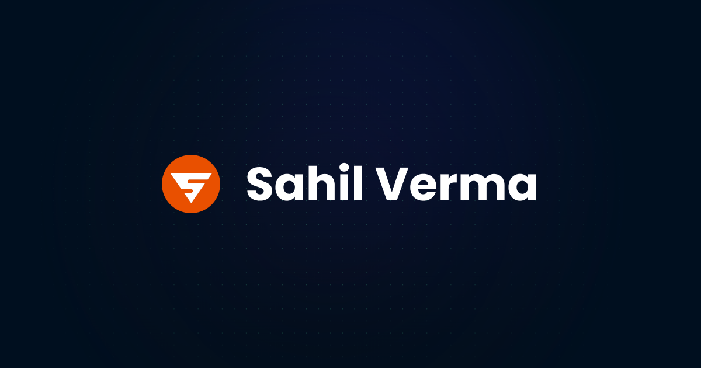

# Sahil Verma Portfolio



Welcome to my portfolio repository! This project showcases my work, skills, and projects using modern technologies to create a highly performant, mobile-responsive, and beautifully designed portfolio site.

## Screenshots

1. **Home Page**
   

1. **About Page**
   

1. **Blogs Page**
   

1. **Projects Page**
   

1. **Contact Page**
   

1. **Blog Page**
   

1. **Project Page**
   

1. **Links Page**
   

---

## Features

- **Performant**: Built with optimized code to ensure fast load times and smooth performance.
- **Mobile Responsive**: Fully responsive design for seamless user experience across devices.
- **Beautiful UI**: Crafted with attention to detail and aesthetics using Radix UI and Tailwind CSS.
- **Static Builds**: Generates static pages for improved performance and deployment ease.
- **Highly SEO Optimized**: Structured and designed to achieve excellent search engine rankings.

---

## Tech Stack

- **[Next 15](https://nextjs.org/)**: Framework for server-rendered React applications.
- **[TypeScript](https://www.typescriptlang.org/)**: Typed JavaScript for enhanced developer experience and code quality.
- **[Tailwind CSS](https://tailwindcss.com/)**: Utility-first CSS framework for styling.
- **[Radix UI](https://www.radix-ui.com/)**: Accessible and unstyled UI primitives.
- **[Motion](https://www.motion.dev/)**: Library for animations and interactive UI.
- **[Remote MDX](https://mdxjs.com/)**: For rendering Markdown and JSX in the same file.
- **[PostHog](https://posthog.com/)**: Analytics platform for understanding user behavior.

---

## Getting Started

### Prerequisites

Ensure you have the following installed:

- Node.js
- npm or yarn or pnpm or bun

### Installation

1. Clone the repository:

   ```bash
   git clone https://github.com/sahilverma-dev/sahilverma-portfolio

   cd sahilverma-portfolio
   ```

2. Install dependencies:

   ```bash
   npm install

   # or

   yarn install

   # or

   bun install
   ```

3. Run the development server:

   ```bash
   npm run dev

   # or

   yarn dev

   # or

   bun dev
   ```

4. Open [http://localhost:3000](http://localhost:3000) in your browser to view the project.

### Build for Production

To generate a static build:

```bash
npm run build
npm run start

# or

yarn build
yarn start

# or

bun build
bun start
```

---

## Contributing

Contributions are appreciated! Feel free to open issues for suggestions or feedback, but I won't be accepting pull requests as I prefer building this myself. You're welcome to use this portfolio as a template for your own with any customizations you like.

---

## Acknowledgements

- **Next.js** for an amazing React framework.
- **Tailwind CSS** for utility-first styling.
- **Radix UI** for accessible and customizable components.
- **Motion** for smooth animations.
- **PostHog** for insightful analytics.

## Connect with Me

- Portfolio: [sahilverma.dev](https://sahilverma.dev)
- Instagram: [sahilverma.dev](https://instagram.com/sahilverma.dev)
- Discord: [sahilverma.dev](https://discord.com/users/669542427454996490)
- Twitter(𝕏): [sahilverma_dev](https://twitter.com/sahilverma_dev)
- LinkedIn: [sahilverma-dev](https://www.linkedin.com/in/sahilverma-dev/)
- Dev.to Articles: [sahilverma_dev](https://dev.to/sahilverma_dev)
